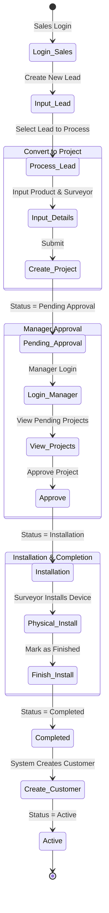
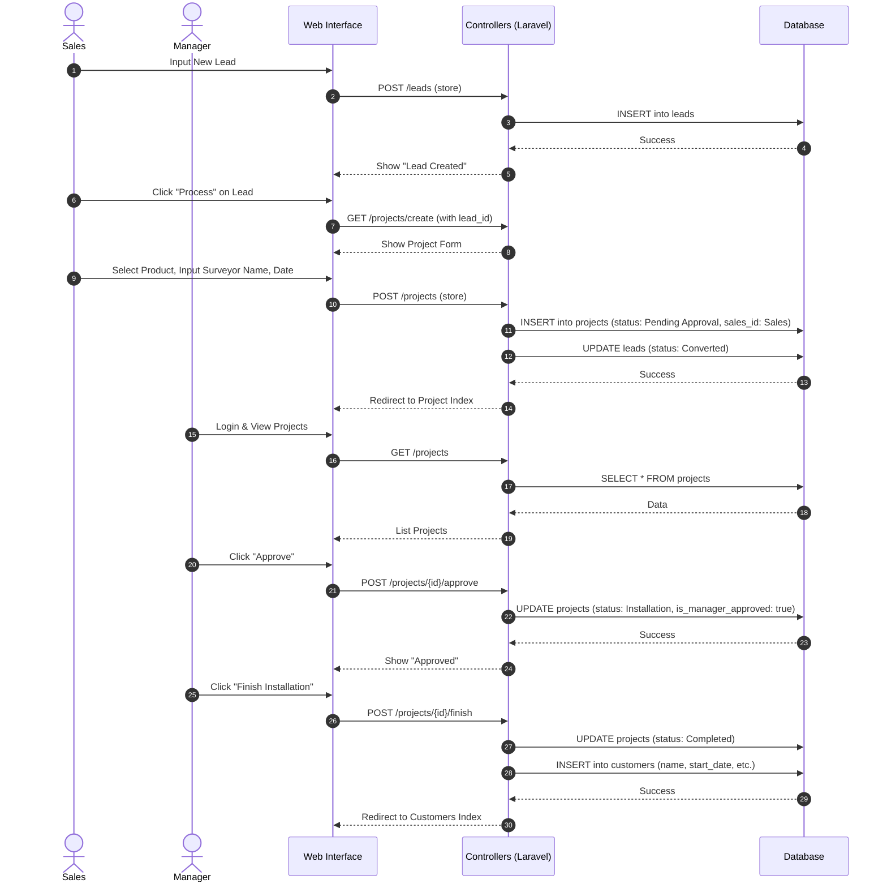

# PT. Smart CRM

A Customer Relationship Management system for managing Leads, Projects, and Customers.

## Credentials
- **Manager**: `manager@smart.co.id` / `password`
- **Sales**: `sales@smart.co.id` / `password`

---

# Standard Operating Procedure (SOP) & CRM Workflow

This document outlines the step-by-step workflow for the PT. Smart CRM system, covering the lifecycle from Lead acquisition to Customer activation.

## Roles
- **Sales**: Responsible for finding, inputting, and converting Leads to Projects.
- **Manager**: Responsible for monitoring performance and approving/finalizing Projects.
- **Surveyor**: (Field Role) Responsible for physical installation.

## Workflow Steps

### 1. Lead Acquisition (Sales)
**Goal**: Record potential customer interest.
1.  **Login** as Sales Staff.
2.  Navigate to **Leads / Calon**.
3.  Click **"Tambah Lead Manual"**.
4.  Fill in the form:
    -   **Nama Customer**: Name of the potential client.
    -   **Alamat**: Installation address.
    -   **Kontak**: Email and Phone Number.
    -   **Produk Diminati**: Select the internet package.
5.  Click **"Simpan"**.
    -   *System Status*: `New`

### 2. Lead Processing (Sales)
**Goal**: Follow up and close the deal.
1.  Navigate to **Leads**.
2.  Locate the Lead. Use "Edit" to update status (e.g., to `Contacted` or `Qualified`) as negotiation progresses.
3.  **To Close Deal**: Click the **"Proses"** button on the Lead card.
4.  **Project Information Form**:
    -   **Paket yang Dipilih**: Confirm the final product.
    -   **Nama Surveyor**: Manual input of the technician assigned for installation (e.g., "Budi", "Team A").
    -   **Jadwal Instalasi**: Select the agreed installation date.
5.  Click **"Buat Project"**.
    -   *System Status*: Project created with status `Pending Approval`.
    -   *System Action*: Lead status updates to `Converted`.

### 3. Manager Approval (Manager)
**Goal**: Validate the sale and authorize installation.
1.  **Login** as Manager.
2.  Navigate to **Project & Approval** (or check Dashboard overview).
3.  Review projects with status `Pending Approval`.
4.  Click **"Approve"** (Checkmark icon).
    -   *System Status*: Project updates to `Installation`.
    -   *Note*: This signals the Surveyor to proceed.

### 4. Installation & Finalization (Manager/System)
**Goal**: Confirm physical installation and start subscription.
1.  **Offline Action**: Surveyor performs installation on the scheduled date.
2.  Upon successful installation reporting, Manager performs the final step.
3.  Navigate to **Project & Approval**.
4.  Locate the project with status `Installation`.
5.  Click **"Selesai & Aktifkan"** (Checkmark/Finish icon).
    -   *System Status*: Project updates to `Completed`.
    -   *System Action*: A new **Customer** record is created automatically with Active status.
    -   *System Action*: Subscription Start Date is set to today.

### 5. Monitoring & Analytics (Manager)
**Goal**: Track performance.
1.  Navigate to **Dashboard**.
2.  **Analisis Performa Section**:
    -   **Top Performing Sales**: View which Salesperson generates the most projects.
    -   **Instalasi per Surveyor**: View workload distribution among Surveyors based on the "Nama Surveyor" input.
3.  **Filters**: Use the filter bar to search specific Sales or Surveyor names to refine the data.

---

# System Diagrams

## Workflow Activity Diagram
This diagram illustrates the end-to-end flow from Lead generation to Customer activation.

## Sequence Diagram
This diagram details the interactions between the Users, System Components (UI/Controllers), and the Database.

